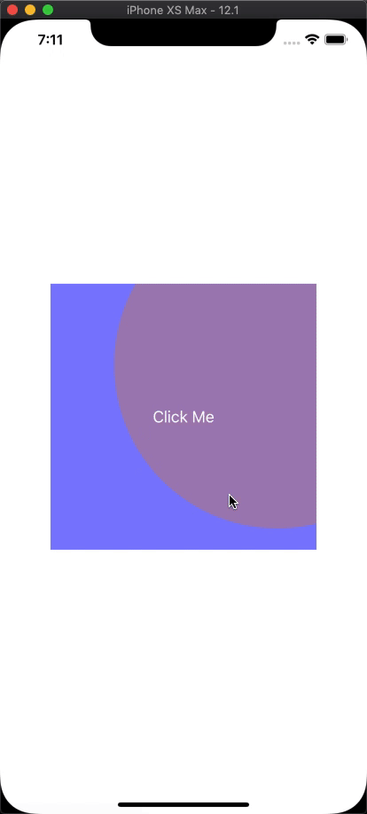

# WGBWaveLayerButton

<p align='center'>

<a href="https://cocoapods.org/pods/WGBWaveLayerButton">  </a>


<a href=""></a>
<a href="http://wangguibin.github.io"></a>

</p>
## Example


To run the example project, clone the repo, and run `pod install` from the Example directory first.

## Requirements

## Installation

WGBWaveLayerButton is available through [CocoaPods](https://cocoapods.org). To install
it, simply add the following line to your Podfile:

```ruby
pod 'WGBWaveLayerButton'
```

## Author

Wangguibin, 864562082@qq.com

## License

WGBWaveLayerButton is available under the MIT license. See the LICENSE file for more info.
